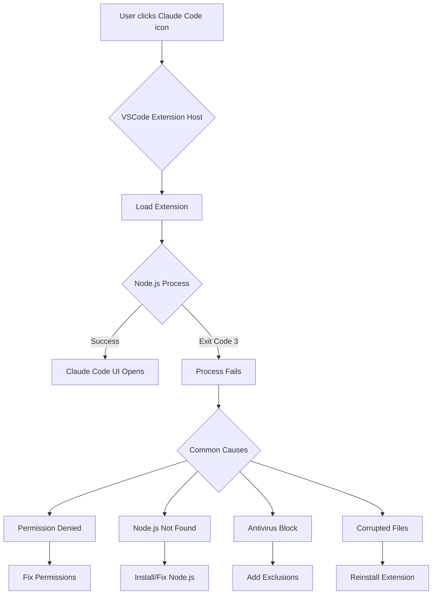

# Claude Code Exit Code 3 Troubleshooting Guide

## Problem Summary

**Error**: "Claude Code process exited with code 3"  
**When**: Occurs when clicking the Claude Code icon in VSCode's activity bar  
**Environment**: Windows 11, PowerShell execution policies already set to RemoteSigned  
**Symptoms**: No output in Claude Code output panel, extension fails to start

## Root Cause Analysis

Exit code 3 on Windows typically indicates one of the following issues:

1. **Node.js Process Failure**: The extension's Node.js process cannot start properly
2. **Permission Issues**: Despite execution policy being set, file system permissions may block execution
3. **Extension Installation Corruption**: Extension files may be corrupted or incomplete
4. **Antivirus/Security Software**: Windows Defender or antivirus blocking the extension process
5. **Path Resolution Issues**: VSCode cannot locate required dependencies

## Diagnostic Steps

### 1. Verify Node.js Installation

```powershell
# Check Node.js version (Claude Code requires Node.js 18 or higher)
node --version

# Check npm version
npm --version

# Verify Node.js is in PATH
where.exe node
```

**Expected**: Node.js v18.x.x or higher  
**Action if fails**: Install or update Node.js from [nodejs.org](https://nodejs.org/)

### 2. Check VSCode Extension Installation

```powershell
# Navigate to VSCode extensions directory
cd "$env:USERPROFILE\.vscode\extensions"

# List Claude Code extension
dir | Select-String "anthropics.claude"
```

**Expected**: Directory like `anthropics.claude-code-x.x.x`  
**Action if missing**: Reinstall Claude Code extension from VSCode marketplace

### 3. Review Extension Host Logs

1. Open VSCode Command Palette (`Ctrl+Shift+P`)
2. Run: `Developer: Show Logs...`
3. Select: `Extension Host`
4. Look for errors related to Claude Code or exit code 3

### 4. Check File Permissions

```powershell
# Check permissions on extensions directory
Get-Acl "$env:USERPROFILE\.vscode\extensions" | Format-List

# Check specific Claude Code extension permissions
Get-Acl "$env:USERPROFILE\.vscode\extensions\anthropics.claude-code-*" | Format-List
```

**Expected**: Current user should have Full Control  
**Action if fails**: Reset permissions (see Solution 4 below)

### 5. Check Windows Defender/Antivirus

```powershell
# Check Windows Defender exclusions
Get-MpPreference | Select-Object -ExpandProperty ExclusionPath
```

**Action**: Add VSCode and extensions directory to exclusions (see Solution 5 below)

## Solutions (Priority Order)

### Solution 1: Reinstall Claude Code Extension (Recommended First Step)

1. **Uninstall Claude Code**:
   - Open VSCode Extensions panel (`Ctrl+Shift+X`)
   - Find "Claude Code" extension
   - Click gear icon → Uninstall
   
2. **Clear Extension Cache**:
   ```powershell
   # Close VSCode first, then run:
   Remove-Item -Recurse -Force "$env:USERPROFILE\.vscode\extensions\anthropics.claude-code-*"
   Remove-Item -Recurse -Force "$env:APPDATA\Code\User\workspaceStorage\*\anthropics.claude-code"
   ```

3. **Reinstall Claude Code**:
   - Restart VSCode
   - Install Claude Code from Extensions marketplace
   - Restart VSCode again

### Solution 2: Run VSCode as Administrator

1. Close all VSCode instances
2. Right-click VSCode shortcut
3. Select "Run as administrator"
4. Try clicking Claude Code icon again

**If this works**: There's a permissions issue. Apply Solution 4 to fix permanently.

### Solution 3: Update PowerShell Execution Policy (Process-Level)

```powershell
# Run PowerShell as Administrator
Set-ExecutionPolicy -ExecutionPolicy Bypass -Scope Process -Force

# Then in same window, start VSCode
code
```

### Solution 4: Fix File Permissions

```powershell
# Run PowerShell as Administrator

# Reset permissions on extensions directory
$path = "$env:USERPROFILE\.vscode\extensions"
$acl = Get-Acl $path
$acl.SetAccessRuleProtection($false, $true)
Set-Acl -Path $path -AclObject $acl

# Grant full control to current user
$username = [System.Security.Principal.WindowsIdentity]::GetCurrent().Name
$rule = New-Object System.Security.AccessControl.FileSystemAccessRule($username, "FullControl", "ContainerInherit,ObjectInherit", "None", "Allow")
$acl.SetAccessRule($rule)
Set-Acl -Path $path -AclObject $acl
```

### Solution 5: Add Windows Defender Exclusions

```powershell
# Run PowerShell as Administrator

# Add VSCode directories to exclusions
Add-MpPreference -ExclusionPath "$env:LOCALAPPDATA\Programs\Microsoft VS Code"
Add-MpPreference -ExclusionPath "$env:USERPROFILE\.vscode"
Add-MpPreference -ExclusionPath "$env:APPDATA\Code"

# Add Node.js to exclusions
Add-MpPreference -ExclusionPath "$env:ProgramFiles\nodejs"
```

### Solution 6: Check for Conflicting Extensions

Known conflicting extensions:
- Other AI coding assistants (GitHub Copilot, Cody, etc.)
- Terminal managers that override shell behavior
- Security extensions that block process execution

**Action**: Disable other extensions temporarily and test Claude Code

### Solution 7: Clean VSCode Configuration

```powershell
# Backup first!
Copy-Item "$env:APPDATA\Code\User\settings.json" "$env:APPDATA\Code\User\settings.json.backup"

# Clear extension state
Remove-Item -Recurse -Force "$env:APPDATA\Code\User\globalStorage\anthropics.claude-code"
Remove-Item -Recurse -Force "$env:APPDATA\Code\User\workspaceStorage"
```

### Solution 8: Verify Environment Variables

```powershell
# Check PATH includes Node.js
$env:PATH -split ';' | Select-String "nodejs"

# If missing, add Node.js to PATH
[Environment]::SetEnvironmentVariable("Path", $env:Path + ";C:\Program Files\nodejs", [System.EnvironmentVariableTarget]::User)
```

### Solution 9: Check Windows Event Viewer

1. Open Event Viewer (`eventvwr.msc`)
2. Navigate to: Windows Logs → Application
3. Filter for errors around the time Claude Code fails
4. Look for errors from:
   - "Application Error"
   - "VSCode" or "Electron"
   - "Node.js"

### Solution 10: Complete Clean Reinstall

```powershell
# 1. Backup settings
Copy-Item "$env:APPDATA\Code\User\settings.json" "~\Desktop\vscode-settings-backup.json"

# 2. Close VSCode

# 3. Uninstall Claude Code extension

# 4. Clean all traces
Remove-Item -Recurse -Force "$env:USERPROFILE\.vscode\extensions\anthropics.claude-code-*"
Remove-Item -Recurse -Force "$env:APPDATA\Code\User\globalStorage\anthropics.claude-code"
Remove-Item -Recurse -Force "$env:APPDATA\Code\User\workspaceStorage"
Remove-Item -Recurse -Force "$env:APPDATA\Code\CachedExtensions"

# 5. Restart computer

# 6. Run VSCode as Administrator

# 7. Reinstall Claude Code

# 8. Test without Administrator (restart VSCode normally)
```

## Additional Diagnostics

### Check Claude Code Extension Logs Manually

```powershell
# Navigate to extension directory
cd "$env:USERPROFILE\.vscode\extensions\anthropics.claude-code-*"

# Check for log files
dir -Recurse *.log

# View recent logs
Get-Content ".\logs\*.log" | Select-Object -Last 50
```

### Enable VSCode Extension Debug Logging

1. Open VSCode settings (`Ctrl+,`)
2. Search for: `extension.logging`
3. Set log level to: `trace`
4. Restart VSCode
5. Check Output panel → Extension Host

## System Architecture Diagram



## Prevention

To avoid this issue in the future:

1. **Keep Node.js Updated**: Regularly update to LTS versions
2. **Antivirus Exclusions**: Maintain exclusions for development tools
3. **Regular Extension Updates**: Keep Claude Code updated
4. **Avoid Manual File Changes**: Don't manually modify extension files
5. **Run as Standard User**: Only use Administrator when necessary

## Next Steps

If none of these solutions work:

1. **Gather Diagnostic Information**:
   ```powershell
   # Create diagnostic report
   $report = @"
   Node.js Version: $(node --version)
   npm Version: $(npm --version)
   VSCode Version: $(code --version)
   PowerShell Version: $($PSVersionTable.PSVersion)
   Execution Policy: $(Get-ExecutionPolicy -List | Out-String)
   Windows Version: $(Get-ComputerInfo | Select-Object WindowsVersion, OsArchitecture | Out-String)
   "@
   
   $report | Out-File "~\Desktop\claude-code-diagnostic.txt"
   ```

2. **Report Issue**: File a bug report at [GitHub Issues](https://github.com/anthropics/claude-code/issues)
   - Include diagnostic report
   - Include Extension Host logs
   - Include steps to reproduce

## Quick Reference Commands

```powershell
# Check Node.js
node --version

# Check execution policy
Get-ExecutionPolicy -List

# Fix execution policy
Set-ExecutionPolicy -ExecutionPolicy RemoteSigned -Scope CurrentUser

# Run VSCode as admin
Start-Process code -Verb RunAs

# Clear extension cache
Remove-Item -Recurse -Force "$env:USERPROFILE\.vscode\extensions\anthropics.claude-code-*"

# Add Defender exclusion
Add-MpPreference -ExclusionPath "$env:USERPROFILE\.vscode"
```

## Success Indicators

You'll know the issue is resolved when:
- ✅ Claude Code icon opens the panel without errors
- ✅ No "process exited with code 3" messages appear
- ✅ Extension Host logs show successful extension activation
- ✅ Claude Code UI is functional and responsive